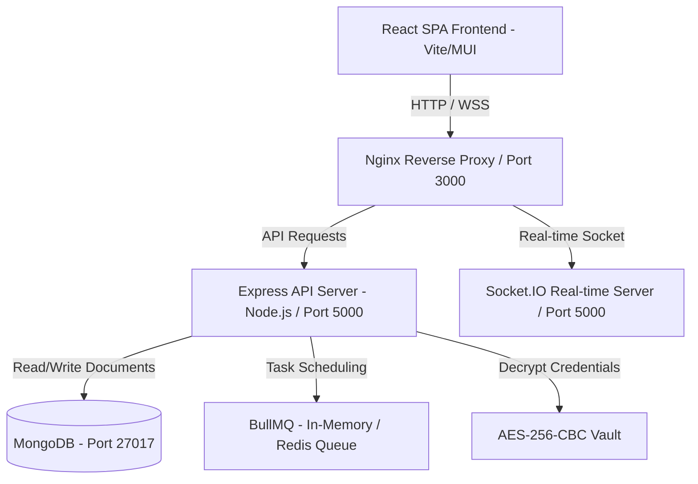

# Architecture Audit Report: One Janitorial Platform

This document outlines the system architecture, core layers, data models, security infrastructure, and current configuration of the One Janitorial Enterprise Staff Platform.

---

## 1. System Topology Overview

---

## 2. Layer Analysis

### A. Frontend Client Layer
- **Core Technology**: React (v18.2.0) built on Vite (v5.2.8).
- **State Management**: Redux Toolkit (`@reduxjs/toolkit` and `react-redux`) managing auth states, employee catalogs, tickets, meetings, and system notifications.
- **Real-Time Client**: Socket.io-client mapping typing states, read receipts, and new messages.
- **Workflow Engine**: React Flow (`reactflow`) rendering topological nodes and DAG structures.
- **Design System**: Material UI (MUI v5) combined with custom CSS overrides for dark mode, glassmorphism, and visual tables.

### B. Backend API & Real-time Layer
- **Core Technology**: Express.js running on Node.js.
- **Socket Server**: Socket.io integrated natively on the HTTP server, mapping presence indicators, room actions (channels, direct messages, workflow runs), and broadcasts.
- **Task Worker**: BullMQ handling background jobs. If Redis (port `6379`) is offline, the worker automatically switches to an in-memory queue dispatcher (`setTimeout`).
- **Telemetry**: Winston logger recording API queries and error traces.

### C. Database & Models Layer
- **Database Engine**: MongoDB.
- **Mongoose Schemas**: Over 40 collections mapping critical janitorial operations. Key schemas:
  - `User`: Handles email, role, hash password, status (Enabled/Disabled), lock policies.
  - `Employee`: Links user profiles to departments, employee IDs, coaching logs.
  - `Ticket`: Tracks customer service issues and operations checklist.
  - `VoiceTranscript`: Integrates voice note recordings, Web Speech API transcripts, and action summaries.
  - `CustomAPI`: Provisioned endpoint paths, linked workflows, schema validators.
  - `CustomRole`: Mappings of custom permissions scopes.

### D. Security & Cryptographic Vault
- **API Security**: JWT (JSON Web Tokens) access + refresh token cycles, secure cookie/headers verify, Helmet headers, express-rate-limit bounds.
- **Secrets Vault**: Dynamic AES-256-CBC encrypted table storing client API keys (HubSpot, Supabase, OpenAI, SendGrid) using standard IV seeds. Environment variables are loaded in-memory on database boot.

---

## 3. Current Deployment Environment
- **Docker Compose**: Sets up services for `backend`, `frontend`, `nginx` reverse proxy, `prometheus` telemetry, and `grafana` dashboards.
- **Local Fallbacks**: When Redis or external APIs (HubSpot, OpenAI) are offline, local mock structures execute cleanly with zero runtime page crashes.
